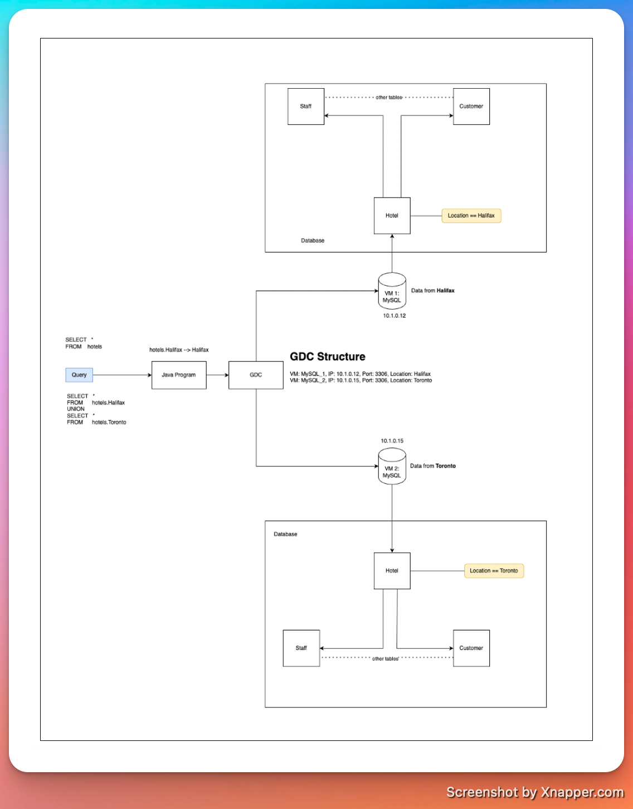
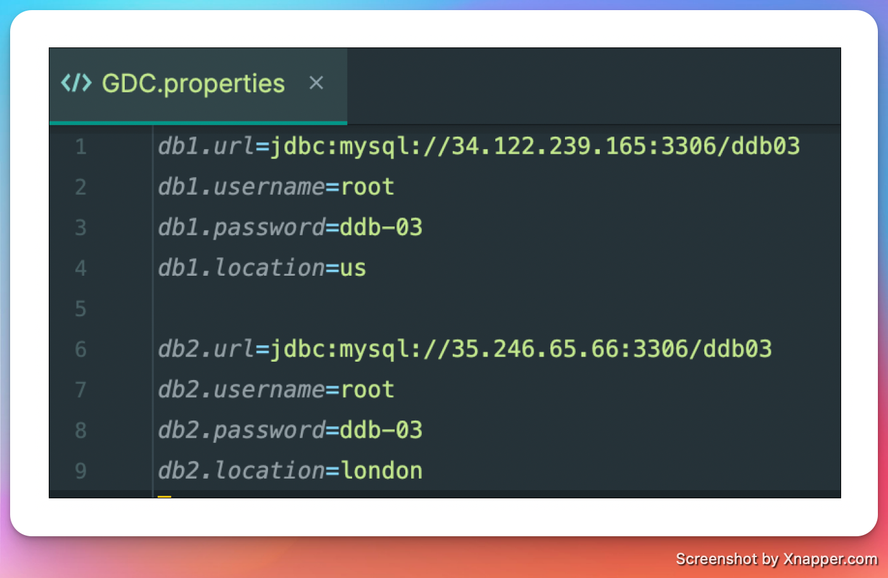
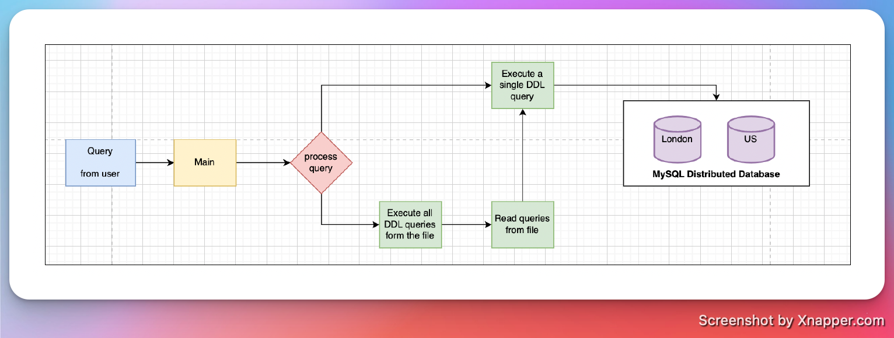

# Distributed-DB

## Table level fragmentation 

## GDC Structure 

- We utilize a text file structure for our Global Database Configuration (GDC), enhancing performance by minimizing access overhead
- The GDC functions akin to a routing table within our Distributed Database (DDB), efficiently directing user-input queries to the appropriate database machine based on their fragment.

## GDC file explanation

- In our Java project, we maintain a GDC.properties file, which serves as the cornerstone of our routing mechanism.

- Within this file, we store crucial information such as the database URL, username, password, and location for each node in our distributed database.
- This file essentially acts as the routing table for user queries.
- It's important to note that the URL attribute is composed, consisting of the Public IP of the VM, the VM's port, and the database name.
- This composition ensures precise routing of queries to the designated database machine.

## Java code explanation

### DistributedDBConnectionFactory

- This module is responsible for establishing connections with distributed databases.
- Essentially, it connects to all the nodes specified in the GDC file.
- It offers methods to execute queries across all nodes or specific ones, depending on the query type (DDL or DML).
- Currently, it supports only DDL operations such as table creation.
- However, we aim to expand its functionality to enable querying specific nodes based on location mapping in the query and GDC for a given node.

### SQLQueryReader

- This module handles the reading of SQL files containing MySQL queries.
- For our demonstration, we compiled all DDL commands for table creation into a single file (DDL.sql under the resources package).
- This module reads queries from the file and transforms them into a list of strings, making them usable by other modules for execution

### Main

- This serves as the entry point for our Java Command-Line Interface (CLI) application.
- It accepts DDL queries inputted by the user and forwards them to other modules for processing and execution.
- Please note that it exclusively supports DDL queries.

Since we are implementing table-level fragmentation, DDL queries are executed on each node specified in the GDC for table creation based on the input query.

### Team

| Name            | Email           |
| --------------- | --------------- |
| Tanuj Doshi     | tn716378@dal.ca |
| Keval Gandevia  | kv476075@dal.ca |
| Avadh Rakholiya | AV786964@DAL.CA |
| Kushal Panchal  | KS735728@DAL.CA |
| Vaibhav Singh   | VB777222@DAL.CA |

---